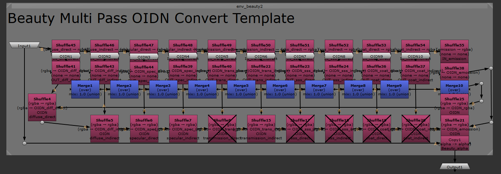

# Channel Checker


A powerful EXR channel validation and analysis tool for Nuke. Analyze image sequences to distinguish channels with actual data from empty channels, and automatically set up nodes for OIDN denoising workflows.

## ✨ Key Features

- **EXR Channel Analysis**: Validate all channels in image sequences to verify actual data presence
- **Frame Step Analysis**: Support for frame interval settings for performance optimization
- **Flexible Frame Number Extraction**: Support for various padding styles (001, 0001, 00001, etc.)
- **OIDN Workflow Support**: Automatic node generation for Intel Open Image Denoise
- **Render Time Optimization**: Reduce ML-based denoiser render times by excluding empty channels
- **Log Export**: Save analysis results to files
- **Standalone Script**: `logic.py` provides non-GUI script functionality for batch processing

## 🚀 Performance Benefits

ML-based denoisers (OIDN, OptiX, Intel AI Denoiser) process each channel individually, meaning that reducing the number of input channels directly decreases computation time. By identifying and excluding empty channels, this tool can significantly reduce denoising render times while maintaining quality.


## 📋 System Requirements

### Required

- **Nuke**: 14.0 or higher
- **Python**: 3.7+
- **PySide**: PySide6 or PySide2
- **[NukeOIDNDenoise](https://github.com/twins-annning/NukeOIDNDenoise)**: Required for OIDN template nodes to function properly

## 🚀 Installation

1. **Install NukeOIDNDenoise plugin first**
   - Download and install from: https://github.com/twins-annning/NukeOIDNDenoise
   - This is required for the OIDN template nodes to work

2. **Clone the repository**
   ```bash
   git clone https://github.com/junopark00/NukeChannelChecker.git
   ```

3. **Copy to Nuke directory**
   ```
   ~/.nuke/NukeChannelChecker/
   ```

4. **Add the line to `init.py`**
   ```python
   import nuke
   nuke.pluginAddPath('./NukeChannelChecker')
   ```

## 📖 Usage

### GUI Usage (channel_checker.py)

1. Select a Read node in Nuke
2. Run the script via the Nuke menu `Scripts/Channel Checker`:
   - **Target Path**: Directory path containing EXR sequences
   - **Frame Step**: Frame interval for analysis (default: 10)
3. Click **Analyze** button to validate channels
4. Review automatically checked/unchecked valid channels
5. Click **Set Nodes** to create OIDN denoising nodes with optimized channel selection


### Script Usage (logic.py)

For non-GUI batch processing, use the standalone script:

```python
from ChannelChecker.script.logic import analyze_sequence

# Analyze sequence
directory_path = "/path/to/your/sequence"
valid_channels, empty_channels, first_seen = analyze_sequence(directory_path, frame_step=10)

print(f"Valid Channels: {valid_channels}")
print(f"Empty Channels: {empty_channels}")
```

## 🔧 Configuration

### Channel Filtering

Configure channels to exclude in the main script:

```python
# In channel_checker.py
channels_filter = ['N.', 'albedo.', 'normal.']  # Channel prefixes to exclude
```

### Results Interpretation

- **O (Green)**: Channel contains data
- **X (Red)**: Empty channel (no data)  
- **Checkbox**: Select channels to include in denoising (unchecked = faster render)

**💡 Tip**: Unchecking empty channels can reduce ML denoiser render times by 20-50% depending on the number of AOVs in your sequence.
